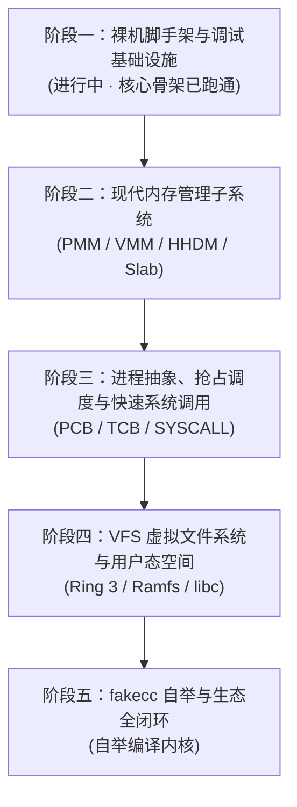

# fakeos

[](https://github.com/esrrhs/fakeos/actions/workflows/ci.yml)
[](LICENSE)

基于自研 C 编译器 [fakecc](https://github.com/esrrhs/fakecc) 从零全新构建的现代原生 64 位操作系统（x86-64）。

---

## 📖 项目愿景与现代化设计准则

`fakeos` 是一套完全基于自主研发的独立 C 编译器 [fakecc](https://github.com/esrrhs/fakecc) 重构的原生现代 64 位操作系统内核（x86-64）。

本项目彻底摒弃传统操作系统几十年来积累的历史兼容包袱（如 16 位实模式、慢速软中断、8259A PIC、C 预处理器文本拼接与宏灾难等），以现代操作系统技术标准从零全新实现。

### 🌟 现代化操作系统核心技术准则

1. **原生 64 位长模式与硬件标准对齐（Native x86-64 Long Mode）**：
   - 彻底告别 16 位实模式与古旧 BIOS 中断，系统从引导阶段立即切入 64 位长模式。
   - 严格遵循 SysV AMD64 ABI 调用规范；引导期全面激活 `CR4.OSFXSR` / `CR4.OSXMMEXCPT` 与 SSE/AVX 向量扩展，保证寄存器保护机制与 ABI 严格契合。

2. **工业级高半核内存布局（Higher-Half Kernel Architecture）**：
   - 内核物理加载在 `0x00100000` (1MB)，虚拟基地址统一映射至负空间 `0xFFFFFFFF80000000` (-2GB 空间)，遵循 `-mcmodel=kernel` 内存规范。
   - 完整的下半部 128TB 巨量虚拟空间全部独立预留给用户空间，实现内核空间与用户态空间的严密物理/虚拟隔离。

3. **现代内存管理与分页模型（Modern Memory Management）**：
   - 全面启用 4 级分页（PML4，并预留 5 级分页 PML5 扩展能力），支持 4KB 标准页与 2MB/1GB 大页。
   - 构建物理内存直接映射区（HHDM: Higher-Half Direct Map），支持无锁/高效物理地址与虚拟地址转换。
   - 物理内存管理采用伙伴系统（Buddy System），内核堆对象分配采用 Slab/Slub 分配器。

4. **现代化异常与中断机制（Modern Exception & APIC Infrastructure）**：
   - 彻底淘汰过时的 8259A PIC 芯片，全面基于 Local APIC 与 I/O APIC 构建现代化中断路由与多核调度基础设施。
   - 基于 64 位中断描述符表（IDT），配置 TSS 与独立的 IST（Interrupt Stack Table）异常中断栈，即便在内核发生栈溢出（Stack Overflow）或双重错误（Double Fault）时也能安全捕获并打印全量寄存器快照 Dump。

5. **高效特权级隔离与原生快速系统调用（Hardware-Native Isolation & Fast Syscalls）**：
   - 彻底废弃慢速过时的 `int 0x80` 软中断陷入机制。
   - 全面采用 x86-64 硬件原生提供的 `SYSCALL` / `SYSRET` 机制，配合 `MSR_LSTAR` 与 `MSR_SFMASK` 实现纳秒级特权级上下文切换。

6. **全栈编译器与内核自洽闭环（fakecc Package Ecosystem）**：
   - 彻底摒弃 C 语言脆弱且容易命名污染的头文件（`#include`）与宏定义（`#define`），以现代类似 Go 的 Package 模块体系驱动内核。
   - 依托 `fakecc` 优秀的 SSA 中端优化与内嵌 ELF 目标生成能力，打通“C 源码 -> 内核机器码 -> 运行测试 -> 自举重编译”全链路。

---

## 🏗️ 整体架构设计

```
+-------------------------------------------------------------------+
|                     User Space (Applications)                     |
|         Shell / Coreutils / Editor / fakecc (自举闭环)            |
+-------------------------------------------------------------------+
|                        fakecc Runtime / libc                      |
|                系统调用封装 / 堆内存管理 / 标准流 I/O                |
+===================================================================+
|                     fakeos Kernel (x86-64)                        |
|  +-------------------------------------------------------------+  |
|  | Fast Syscall Dispatcher (SYSCALL / SYSRET / MSR_LSTAR)      |  |
|  +-------------------------------------------------------------+  |
|  | Process & Preemptive Scheduler (PCB / TCB / Context Switch) |  |
|  +-------------------------------------------------------------+  |
|  | Virtual Memory Manager (PML4 / HHDM / VMA / Demand Paging)  |  |
|  +-------------------------------------------------------------+  |
|  | Memory Allocators (Physical Buddy Allocator / Slab / Slub)  |  |
|  +-------------------------------------------------------------+  |
|  | VFS & File Systems (VFS Core / Ramfs / Ext2)                |  |
|  +-------------------------------------------------------------+  |
|  | Modern Device Drivers (UART 16550 / Framebuffer / VirtIO)   |  |
|  +-------------------------------------------------------------+  |
|  | Architecture Support (64-bit IDT / TSS IST / APIC / HPET)   |  |
+===================================================================+
|                     Hardware / Hypervisor                         |
|                    x86-64 (QEMU / KVM / Baremetal)                |
+-------------------------------------------------------------------+
```

---

## 📅 实施计划与里程碑方案



### 阶段一：裸机脚手架与调试基础设施（Milestone 1 · 核心骨架已就绪）
- [x] **引导方案确定与链接脚本**：实现 Multiboot 1/2 双兼容头，配置高半核链接脚本（LMA `0x100000`, VMA `0xFFFFFFFF80000000`）。
- [x] **fakecc 现代化编译流水线**：建立跨平台（macOS/Linux）构建系统（Makefile），实现包依赖自动解析与无外部头文件独立编译。
- [x] **64 位长模式切换与初始分页**：实现 32 位到 64 位长模式跳转，开启 PAE、Paging 与 SSE 向量支持，搭建初始 4 级页表。
- [x] **基础控制台输出驱动**：实现 UART 16550 串口驱动（COM1 115200 8N1）与 VGA 80x25 文本显存控制台驱动（支持硬件光标与平滑滚屏）。
- [x] **内核格式化日志系统**：实现内核级双通道格式化日志函数 `kprintf`（同步输出至串口终端与屏幕）。
- [x] **自动化测试与 CI 流水线**：编写无头 QEMU 自动化回归测试脚本（`make test`），接入 GitHub Actions 持续集成。
- [ ] **64 位 IDT 中断描述符表**：构建 64 位中断门与陷阱门描述符结构，实现统一中断入口派发表。
- [ ] **CPU 异常捕获与寄存器 Dump**：实现 0~31 号硬件异常（重点覆盖 Page Fault `#PF` 与 General Protection Fault `#GP`）的汇编上下文保存桩（Stubs）与全景寄存器快照 Dump。
- [ ] **TSS 与 IST 独立异常栈**：初始化 64 位任务状态段（TSS），配置 Interrupt Stack Table，防护内核栈溢出与 Double Fault。
- [ ] **Local APIC 定时器初始化**：配置 APIC Timer 提供稳定的高精度系统时钟节拍（Tick）。

### 阶段二：现代内存管理子系统（Milestone 2）
- [ ] **物理内存管理器（PMM）**：解析 Multiboot 提供的内存映射图，实现基于位图（Bitmap）及伙伴系统（Buddy System）的 4KB 物理页分配与释放。
- [ ] **高端物理直接映射（HHDM）**：建立全量物理内存在高半空间的直接连续映射区，彻底解决内核访问物理页表的寻址问题。
- [ ] **虚拟内存管理（VMM）**：实现 4 级页表增删查改工具链（PML4 / PDPT / PD / PT），支持页面属性细粒度控制（NX、Read-Only、User/Supervisor、Cache-Disable）。
- [ ] **内核动态堆分配器（Kmalloc / Slab）**：基于伙伴系统物理页构建 Slab/Slub 对象缓存分配器，提供高效 `kmalloc` / `kfree`。
- [ ] **虚存区间与按需分页（VMA & Demand Paging）**：抽象虚拟内存区域（VMA），支持缺页异常（Page Fault）处理、按需分配与写时复制（COW）。

### 阶段三：进程抽象、抢占调度与快速系统调用（Milestone 3）
- [ ] **执行体抽象（PCB / TCB）**：定义进程与线程控制块，封装虚拟地址空间（CR3）、内核栈、用户栈及寄存器执行上下文。
- [ ] **汇编级上下文切换（`switch_to`）**：编写纯汇编上下文保存与恢复原语，实现协作式与抢占式任务调度。
- [ ] **抢占式调度器**：基于时钟中断实现时间片轮转（Round-Robin）调度，逐步演进至 CFS 动态优先级调度模型。
- [ ] **内核同步原语**：实现自旋锁（Spinlock）、睡眠互斥锁（Mutex）与原子操作。
- [ ] **原生快速系统调用（`SYSCALL` / `SYSRET`）**：配置 `MSR_LSTAR`、`MSR_STAR` 与 `MSR_SFMASK`，打通微秒级用户态到内核态的快速陷入路径。

### 阶段四：VFS、现代驱动模型与用户空间（Milestone 4）
- [ ] **虚拟文件系统抽象（VFS）**：设计现代对象模型抽象（`inode`、`dentry`、`file`、`file_operations`、`mount`）。
- [ ] **初始内存文件系统（Ramfs / Initramfs）**：实现内存文件系统挂载与文件读写。
- [ ] **首个 Ring 3 用户态进程（`init`）**：通过 `sysret` 跳转至用户态空间，执行第一个用户空间程序并通过 `syscall` 打印信息。
- [ ] **核心 POSIX 系统调用集**：实现文件及进程系统调用（`open`, `close`, `read`, `write`, `mmap`, `brk`, `fork`, `execve`, `exit`, `waitpid`）。
- [ ] **输入与字符终端（TTY / Keyboard）**：接入 PS/2 键盘中断驱动与行缓冲终端 TTY。
- [ ] **移植 fakecc 运行时（Runtime / Libc）**：基于 fakecc 零依赖运行时，构建用户态基础 C 库，运行交互式 Shell。

### 阶段五：fakecc 自举与生态全闭环（Milestone 5）
- [ ] **文件系统与进程环境完备化**：补齐 `fakecc` 运行所需的文件 I/O 与动态内存系统调用。
- [ ] **编译生成原生 fakecc**：将 `fakecc` 交叉编译为 `fakeos` 用户空间原生可执行 ELF64 文件。
- [ ] **用户空间编译验证**：在 `fakeos` 终端中运行 `fakecc` 编译用户 C 程序并直接执行。
- [ ] **达成终极目标（生态自举）**：在 `fakeos` 系统内部使用 `fakecc` 重新编译出与宿主机逐字节完全一致的 `fakeos` 内核。

---

## 🛠️ 构建与运行

### 依赖环境
- [fakecc](https://github.com/esrrhs/fakecc)（自主研发 C 编译器，建议加入环境变量 `PATH`）
- `nasm`（汇编器）
- `x86_64-elf-binutils`（或 Linux 系统原生 `ld` / `objcopy`）
- `qemu-system-x86_64`（虚拟机与模拟器）
- `python3`（用于自动化回归测试脚本）

### 常用命令
```bash
make          # 编译 64 位高半核内核二进制镜像 (build/fakeos.elf)
make test     # 在 QEMU 无头环境下执行自动化回归测试并校验输出
make qemu     # 在当前终端中无头 (Headless) 启动 QEMU（串口控制台交互，按 Ctrl-A 然后按 X 退出）
make qemu-gui # 启动带图形窗口的 QEMU（查看 VGA 80x25 文本控制台显示画面）
make clean    # 清理所有构建中间文件与产物
```

---

## 📄 开源许可证

本项目采用 [MIT License](LICENSE) 授权许可。
