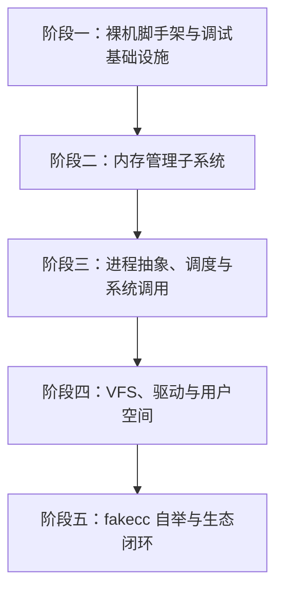

# fakeos

[](LICENSE)

基于自研 C 编译器 [fakecc](https://github.com/esrrhs/fakecc) 从零构建的现代教学与实验性 64 位操作系统（x86-64）。

---

## 📖 项目愿景与设计定位

`fakeos` 是一套完全基于自主研发的独立 C 编译器 [fakecc](https://github.com/esrrhs/fakecc) 构建的原生操作系统内核。

### 核心亮点
1. **编译器级深度自洽与验证**：
   - 传统教学操作系统普遍依赖外部 GNU 工具链（GCC/Clang/Binutils）。`fakeos` 深度整合 `fakecc` 编译器、SSA 优化流水线及内嵌 ELF64 链接能力，实现内核从 C 代码到机器码的全链条可控与自洽验证。
2. **纯净无外部标准库依赖（Freestanding）**：
   - 内核直接基于裸机环境运行，充分利用 `fakecc` 的 `-nostdlib` 模式与内建 GCC 内置函数（如溢出算术、栈帧与位运算支持）。
3. **闭环生态自举终极目标**：
   - 在 `fakeos` 完成用户态与基础 POSIX 系统调用子集后，将 `fakecc` 移植至 `fakeos` 用户空间，达成 **"fakeos 运行 fakecc 编译 fakeos 内核与用户态程序"** 的完全自举闭环。

---

## 🏗️ 整体架构设计

```
+-------------------------------------------------------------------+
|                     User Space (Applications)                     |
|         Shell / Coreutils / Editor / fakecc (自举闭环)            |
+-------------------------------------------------------------------+
|                        fakecc Runtime / libc                      |
|                系统调用封装 / 堆内存管理 / 标准流 I/O                |
+===================================================================+
|                     fakeos Kernel (x86-64)                        |
|  +-------------------------------------------------------------+  |
|  | Syscall Dispatcher (syscall / sysret)                       |  |
|  +-------------------------------------------------------------+  |
|  | Process & Scheduler (PCB / Context Switch / Preemption)     |  |
|  +-------------------------------------------------------------+  |
|  | Virtual Memory (PML4 / Kernel Space / User Page Tables)     |  |
|  +-------------------------------------------------------------+  |
|  | Memory Allocator (Physical Page Frame / Buddy / Slab / Kmalloc) |
|  +-------------------------------------------------------------+  |
|  | VFS & File Systems (Rootfs / Ramfs / Ext2)                  |  |
|  +-------------------------------------------------------------+  |
|  | Device Drivers (UART 16550 / VGA / Keyboard / VirtIO / IDE) |  |
|  +-------------------------------------------------------------+  |
|  | Architecture Support (IDT / GDT / TSS / APIC / PIT / DWARF) |  |
+===================================================================+
|                     Hardware / Hypervisor                         |
|                    x86-64 (QEMU / Bochs / Baremetal)              |
+-------------------------------------------------------------------+
```

---

## 🗺️ 模块划分与详细设计

### 1. 引导与体系结构初始化 (`boot/`, `arch/x86_64/`)
- **Bootloader 协议**：采用 Multiboot2 / Limine 引导协议，快速进入 64 位长模式（Long Mode）。
- **描述符表**：构建全局描述符表（GDT）与任务状态段（TSS），为特权级切换与中断栈准备上下文。
- **中断与异常管理**：
  - 构建中断描述符表（IDT），实现 0-31 号 CPU 异常捕获（如 Page Fault、General Protection Fault 等）并打印寄存器快照。
  - 硬件中断控制器：配置 8259A PIC 与 Local APIC / IO-APIC。
  - 时钟源：PIT / HPET / APIC Timer 提供系统时钟节拍（Tick）。

### 2. 内存管理子系统 (`kernel/mm/`)
- **物理内存管理（PMM）**：解析 Bootloader 提供的物理内存图（Memory Map），实现位图（Bitmap）及伙伴系统（Buddy System）管理物理页帧（4KB Page Frames）。
- **虚拟内存管理（VMM）**：
  - 启用 4 级分页机制（PML4 / PDPT / PD / PT），构建内核高端地址映射（Direct-Mapping / Higher-Half Kernel）。
  - 虚存区域管理（VMA）：支持用户态地址空间分配、惰性分配（Demand Paging）、写时复制（COW）。
- **内核对象分配器**：实现基于连续物理页的 `kmalloc` / `kfree`，结合 Slab / Slub 分配机制优化内核结构体分配。

### 3. 进程与调度子系统 (`kernel/sched/`)
- **执行实体抽象**：定义进程控制块（PCB）与线程控制块（TCB），保存寄存器上下文、内核栈、页表基地址（CR3）与打开文件描述符。
- **上下文切换**：基于汇编编写高效上下文保存与恢复函数。
- **调度算法**：初期支持多级时间片轮转（RR）调度，逐步演进至优先级及抢占式调度机制。
- **进程同步原语**：实现 Spinlock、Mutex 与条件变量。

### 4. 系统调用接口 (`kernel/syscall/`)
- 启用 x86-64 原生 `SYSCALL` / `SYSRET` 快速系统调用指令。
- 建立系统调用派发表，逐步提供兼容 POSIX 标准的系统调用子集（`fork`, `execve`, `exit`, `waitpid`, `read`, `write`, `open`, `close`, `mmap`, `brk` 等）。

### 5. 文件系统与虚拟文件系统 (`kernel/fs/`)
- **虚拟文件系统（VFS）**：抽象 `inode`、`dentry`、`file` 与 `file_operations` 接口。
- **根文件系统**：支持内置 `Initramfs` / `Ramfs` 内存文件系统；后续扩展持久化只读/读写块文件系统（如 Ext2）。

### 6. 字符与输入输出驱动 (`drivers/`)
- **串口驱动（UART 16550）**：提供早期内核启动日志输出（Early Printk / Console）。
- **显示驱动**：VGA 文本模式 / 帧缓冲区（Framebuffer）控制台输出。
- **键盘驱动**：PS/2 键盘控制器中断驱动与字符映射。
- **块设备驱动**：IDE / AHCI / VirtIO-Block 设备抽象。

### 7. 工具链与 fakecc 深度协同 (`toolchain/`)
- 利用 fakecc 的 `-nostdlib` 编译生成纯独立无依赖的内核 ELF64 二进制。
- 配合 fakecc 生成 DWARF 调试符号，支持 QEMU + GDB 源码级逐行单步调试。

---

## 📅 实施计划与里程碑方案



### 阶段一：裸机脚手架与调试基础设施（Milestone 1）
- [ ] 确定引导方案（Multiboot2），配置最小内核链接脚本（Linker Script，Higher-Half Kernel 映射）。
- [ ] 配置基于 [fakecc](https://github.com/esrrhs/fakecc) 的独立编译与构建脚本（Makefile / CMake）。
- [ ] 实现串口输出（UART 16550）及内核格式化日志函数（`kprintf`）。
- [ ] 完成 64 位 GDT、TSS 与 IDT 初始化，实现通用异常捕获与寄存器 Dump。
- [ ] 配置 QEMU 自动化运行与 GDB 远程调试脚本。

### 阶段二：内存管理子系统（Milestone 2）
- [ ] 解析 Bootloader 内存分布元数据，建立物理页帧管理器（Bitmap / Buddy Allocator）。
- [ ] 实现 4 级分页管理（Page Table Helper），支持虚拟地址映射、解映射与保护属性设置。
- [ ] 划分内核地址空间与直接映射区（Direct Physical Mapping）。
- [ ] 实现内核动态堆内存分配器（`kmalloc` / `kfree`）。

### 阶段三：进程抽象、调度与系统调用（Milestone 3）
- [ ] 设计线程与进程控制块（TCB / PCB），分配独立内核栈与上下文保存结构。
- [ ] 编写汇编级上下文切换（`switch_to`），实现协作式多任务。
- [ ] 配置时钟中断（PIT / APIC Timer），实现基于时间片轮转的抢占式调度器。
- [ ] 配置 `MSR_LSTAR` 与 `SYSCALL` / `SYSRET` 机制，实现用户态到内核态的快速陷入。

### 阶段四：VFS、驱动与用户空间（Milestone 4）
- [ ] 建立 VFS 抽象层与初始内存文件系统（Ramfs / Initramfs）。
- [ ] 接入 PS/2 键盘驱动与 TTY 终端控制台。
- [ ] 编写首个用户态进程（`init`），通过系统调用输出 Hello World。
- [ ] 完善标准系统调用：`open`, `close`, `read`, `write`, `mmap`, `brk`, `fork`, `execve`。
- [ ] 基于 fakecc 现有 `runtime/` 移植用户态 C 运行时库，运行交互式 Shell。

### 阶段五：fakecc 自举与生态闭环（Milestone 5）
- [ ] 补齐 `fakecc` 编译与运行所需的基本文件系统与系统调用支持。
- [ ] 将 `fakecc` 交叉编译为 `fakeos` 用户态原生二进制文件。
- [ ] 在 `fakeos` 系统内部运行 `fakecc` 编译用户级程序并成功执行。
- [ ] 达成终极目标：在 `fakeos` 上使用 `fakecc` 重新编译 `fakeos` 内核。

---

## 🛠️ 构建与运行

### 依赖环境
- [fakecc](https://github.com/esrrhs/fakecc)（建议加入环境变量 `PATH`）
- `qemu-system-x86_64`
- `xorriso` / `grub-mkrescue`（用于制作可引导 ISO 镜像）
- `gdb`（可选，用于内核源码单步调试）

### 运行方式（规划中）
```bash
make build    # 使用 fakecc 编译内核与制作镜像
make qemu     # 在 QEMU 虚拟机中启动 fakeos
make debug    # 启动 QEMU 并等待 GDB 调试连接
```

---

## 📄 开源许可证

本项目采用 [MIT License](LICENSE) 授权许可。
