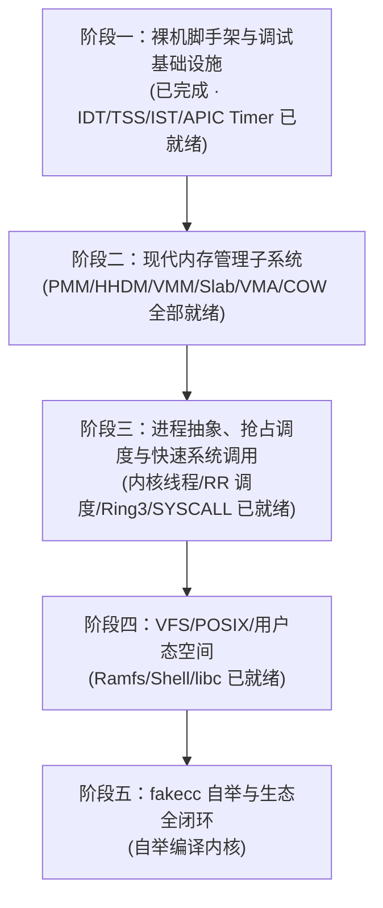

# fakeos

[](https://github.com/esrrhs/fakeos/actions/workflows/ci.yml)
[](LICENSE)

基于自研 C 编译器 [fakecc](https://github.com/esrrhs/fakecc) 从零全新构建的现代原生 64 位操作系统（x86-64）。

---

## 📖 项目愿景与现代化设计准则

`fakeos` 是一套完全基于自主研发的独立 C 编译器 [fakecc](https://github.com/esrrhs/fakecc) 重构的原生现代 64 位操作系统内核（x86-64）。

本项目彻底摒弃传统操作系统几十年来积累的历史兼容包袱（如 16 位实模式、慢速软中断、8259A PIC、C 预处理器文本拼接与宏灾难等），以现代操作系统技术标准从零全新实现。

### 🌟 现代化操作系统核心技术准则

1. **原生 64 位长模式与硬件标准对齐（Native x86-64 Long Mode）**：
   - 彻底告别 16 位实模式与古旧 BIOS 中断，系统从引导阶段立即切入 64 位长模式。
   - 严格遵循 SysV AMD64 ABI 调用规范；引导期全面激活 `CR4.OSFXSR` / `CR4.OSXMMEXCPT` 与 SSE/AVX 向量扩展，保证寄存器保护机制与 ABI 严格契合。

2. **工业级高半核内存布局（Higher-Half Kernel Architecture）**：
   - 内核物理加载在 `0x00100000` (1MB)，虚拟基地址统一映射至负空间 `0xFFFFFFFF80000000` (-2GB 空间)，遵循 `-mcmodel=kernel` 内存规范。
   - 完整的下半部 128TB 巨量虚拟空间全部独立预留给用户空间，实现内核空间与用户态空间的严密物理/虚拟隔离。

3. **现代内存管理与分页模型（Modern Memory Management）**：
   - 全面启用 4 级分页（PML4，并预留 5 级分页 PML5 扩展能力），支持 4KB 标准页与 2MB/1GB 大页。
   - 构建物理内存直接映射区（HHDM: Higher-Half Direct Map），支持无锁/高效物理地址与虚拟地址转换。
   - 物理内存管理采用伙伴系统（Buddy System），内核堆对象分配采用 Slab/Slub 分配器。

4. **现代化异常与中断机制（Modern Exception & APIC Infrastructure）**：
   - 彻底淘汰过时的 8259A PIC 芯片，全面基于 Local APIC 与 I/O APIC 构建现代化中断路由与多核调度基础设施。
   - 基于 64 位中断描述符表（IDT），配置 TSS 与独立的 IST（Interrupt Stack Table）异常中断栈，即便在内核发生栈溢出（Stack Overflow）或双重错误（Double Fault）时也能安全捕获并打印全量寄存器快照 Dump。

5. **高效特权级隔离与原生快速系统调用（Hardware-Native Isolation & Fast Syscalls）**：
   - 彻底废弃慢速过时的 `int 0x80` 软中断陷入机制。
   - 全面采用 x86-64 硬件原生提供的 `SYSCALL` / `SYSRET` 机制，配合 `MSR_LSTAR` 与 `MSR_SFMASK` 实现纳秒级特权级上下文切换。

6. **全栈编译器与内核自洽闭环（fakecc Package Ecosystem）**：
   - 彻底摒弃 C 语言脆弱且容易命名污染的头文件（`#include`）与宏定义（`#define`），以现代类似 Go 的 Package 模块体系驱动内核。
   - 依托 `fakecc` 优秀的 SSA 中端优化与内嵌 ELF 目标生成能力，打通“C 源码 -> 内核机器码 -> 运行测试 -> 自举重编译”全链路。

---

## 🏗️ 整体架构设计

```
+-------------------------------------------------------------------+
|                     User Space (Applications)                     |
|         Shell / Coreutils / Editor / fakecc (自举闭环)            |
+-------------------------------------------------------------------+
|                        fakecc Runtime / libc                      |
|                系统调用封装 / 堆内存管理 / 标准流 I/O                |
+===================================================================+
|                     fakeos Kernel (x86-64)                        |
|  +-------------------------------------------------------------+  |
|  | Fast Syscall Dispatcher (SYSCALL / SYSRET / MSR_LSTAR)      |  |
|  +-------------------------------------------------------------+  |
|  | Process & Preemptive Scheduler (PCB / TCB / Context Switch) |  |
|  +-------------------------------------------------------------+  |
|  | Virtual Memory Manager (PML4 / HHDM / VMA / Demand Paging)  |  |
|  +-------------------------------------------------------------+  |
|  | Memory Allocators (Physical Buddy Allocator / Slab / Slub)  |  |
|  +-------------------------------------------------------------+  |
|  | VFS & File Systems (VFS Core / Ramfs / Ext2)                |  |
|  +-------------------------------------------------------------+  |
|  | Modern Device Drivers (UART 16550 / Framebuffer / VirtIO)   |  |
|  +-------------------------------------------------------------+  |
|  | Architecture Support (64-bit IDT / TSS IST / APIC / HPET)   |  |
+===================================================================+
|                     Hardware / Hypervisor                         |
|                    x86-64 (QEMU / KVM / Baremetal)                |
+-------------------------------------------------------------------+
```

---

## 📅 实施计划与里程碑方案



### 阶段一：裸机脚手架与调试基础设施（Milestone 1 · 已完成）
- [x] **引导方案确定与链接脚本**：实现 Multiboot 1/2 双兼容头，配置高半核链接脚本（LMA `0x100000`, VMA `0xFFFFFFFF80000000`）。
- [x] **fakecc 现代化编译流水线**：建立跨平台（macOS/Linux）构建系统（Makefile），实现包依赖自动解析与无外部头文件独立编译。
- [x] **64 位长模式切换与初始分页**：实现 32 位到 64 位长模式跳转，开启 PAE、Paging 与 SSE 向量支持，搭建初始 4 级页表。
- [x] **基础控制台输出驱动**：实现 UART 16550 串口驱动（COM1 115200 8N1）与 VGA 80x25 文本显存控制台驱动（支持硬件光标与平滑滚屏）。
- [x] **内核格式化日志系统**：实现内核级双通道格式化日志函数 `kprintf`（同步输出至串口终端与屏幕）。
- [x] **自动化测试与 CI 流水线**：编写无头 QEMU 自动化回归测试脚本（`make test`），接入 GitHub Actions 持续集成。
- [x] **64 位 IDT 中断描述符表**：构建 64 位中断门与陷阱门描述符结构，实现统一中断入口派发表（0~47 + 255 spurious，共 49 个门）。
- [x] **CPU 异常捕获与寄存器 Dump**：实现 0~31 号硬件异常（重点覆盖 Page Fault `#PF` 与 General Protection Fault `#GP`）的汇编上下文保存桩（Stubs）与全景寄存器快照 Dump，内核内置 `#DE` / `#UD` / `#PF` 触发-恢复自测。
- [x] **TSS 与 IST 独立异常栈**：初始化 64 位任务状态段（TSS），配置 RSP0 与 IST1 Double Fault 独立守护栈（16 KiB），可防护内核栈溢出。
- [x] **Local APIC 定时器初始化**：启用 IA32_APIC_BASE，建立 LAPIC MMIO 高半核映射，以 PIT 通道 2 校准 APIC Timer 分频，提供稳定的 100 Hz 周期时钟节拍（Tick）。

### 阶段二：现代内存管理子系统（Milestone 2 · PMM/VMM/Slab 已就绪）
- [x] **物理内存管理器（PMM）**：解析 Multiboot 1 提供的内存映射图（mmap，含 ACPI/MMIO 孔洞识别与无 mmap 时的 mem_upper 回退），实现 11 阶伙伴系统（Buddy System，4KiB ~ 4MiB 块），空闲链表按物理地址有序、分裂/合并/双重释放防护完备，提供 `pmm_alloc_page(s)` / `pmm_free_page(s)`；当前管理上限 4 GiB 物理内存。
- [x] **高端物理直接映射（HHDM）**：引导期在 `0xFFFF800000000000`（PML4[256]）建立首个 1 GiB 物理内存的 2MiB 大页直接映射；PMM 首个 buddy 就绪后用 VMM 动态补齐 1 GiB 以上全部 RAM 的 2MiB 映射（页表帧由 buddy 供给），随后撤销临时恒等映射，低半地址空间完整让渡给用户态。实测 2 GiB / 4 GiB 机型正确纳管。
- [x] **虚拟内存管理（VMM）**：实现 4 级页表增删查改工具链（PML4 / PDPT / PD / PT，含 2 MiB 大页），`vmm_map` / `vmm_unmap` / `vmm_translate` 支持属性细粒度控制（NX（开启 EFER.NXE）、Read-Only、User/Supervisor、PWT/PCD 缓存策略），惰性建表、重复映射/冲突大页拒绝、INVLPG 精确失效。
- [x] **内核动态堆分配器（Kmalloc / Slab）**：8 个尺寸类（16B ~ 2048B）单页 Slab 缓存（页首 32B 描述符 + 侵入式空闲链），超大对象直通伙伴系统（8KiB ~ 4MiB 幂整块）；按帧 O(1) 分派表支撑精确 `kmalloc` / `kfree` 与双重释放防护。
- [x] **虚存区间与按需分页（VMA & Demand Paging）**：每进程独立 PML4（内核/HHDM 槽共享、低半空间私有），匿名 VMA 预留 + 首次触页按需分配零页；`#PF` 处理器支持 PROT_READ/WRITE 权限校验、非映射守卫拒绝；实现帧引用计数驱动的**写时复制（COW）fork**——克隆时目录表私有深拷贝、叶子共享置只读并计数，写触发私有拷贝，父空间数据隔离。

### 阶段三：进程抽象、抢占调度与快速系统调用（Milestone 3 · Ring3/SYSCALL 已就绪）
- [x] **执行体抽象（TCB）**：32 槽线程控制块，封装内核栈（buddy 分配 16 KiB）、入口/参数、状态与保存的 RSP；kmain 作为 0 号 idle 上下文。
- [x] **汇编级上下文切换（`switch_to`）**：纯汇编 callee-saved RSP 上下文切换原语 + 新线程跳板；实现协作式 `sched_yield` 与基于 Local APIC tick 的**时间片抢占式轮转调度**，`kthread_create/exit` 生命周期完整（退出回收栈且不参与轮转）。
- [x] **同步原语**：xchg 测试-设置自旋锁与中断标志 save/restore 原语，切换窗口关中断防止 tick 嵌套切换破坏栈帧；并修复 spurious vector 255 滞留 ISR 会把 APIC PPR 抬到 15 级从而饿死定时器的问题（按 ISR 位条件 EOI，未用 LVT 源全部屏蔽）。
- [ ] **调度策略演进**：当前为基于时钟中断的时间片轮转（Round-Robin，idle 槽让路），后续演进至动态优先级/CFS 模型与等待队列（阻塞/唤醒）。
- [ ] **睡眠锁与原子操作**：自旋锁已就绪；后续补充互斥锁（Mutex）、信号量与睡眠/唤醒等待队列。
- [x] **用户进程与 PCB**：TCB 扩展 pid/地址空间句柄/用户态标志；每进程独立 PML4 低半空间 + 按需分页用户栈，经 `user_iret_trampoline`（IRETQ 帧）首次进入 Ring 3；切换时联动 CR3、TSS RSP0 与 SYSCALL 内核栈；内嵌极简 ELF64 装载器按 `PT_LOAD` 权限预置 RX/RW 段。
- [x] **原生快速系统调用（`SYSCALL` / `SYSRET`）**：配置 `MSR_STAR`/`MSR_LSTAR`/`MSR_SFMASK`（屏蔽 IF|DF）与 `EFER.SCE`，GDT 布局满足 SYSRET 段选择子推导；`syscall_entry` 在逐线程内核栈上构建 128 字节寄存器帧（用户 RSP 随帧传递，抢占安全），派发 `write/getpid/yield/fork/exit`；`fork` 经 COW 地址空间克隆 + 帧拷贝实现父子双返回；Ring-3 定时器抢占、Ring-3 不可恢复故障单进程猎杀均有自测覆盖。

### 阶段四：VFS、POSIX 系统调用与用户空间（Milestone 4 · 已就绪）
- [x] **虚拟文件系统抽象（VFS）**：`fs` 包提供 inode（常规文件/目录/字符设备）、目录项父子树、打开文件表（offset/refcount）与根挂载；内核态绝对/相对路径解析（多斜杠折叠、`.`/`..`、cwd 规范化）；所有跨包对象以 u32 句柄传递，操作按 inode 类型 if 链分派。
- [x] **内存文件系统（Ramfs）**：静态文件指向 incbin 内核镜像（只读不可变，写打开被拒），运行时文件为 kmalloc/buddy 支撑的动态缓冲（2 倍扩容、1 MiB 上限、稀疏零填充）；目录支持创建与 48 字节定长记录枚举。`/bin/{init,sh,hello,cat,ls}` 与 `/etc/motd` 经多 blob `incbin` 发布，启动时逐级建目录释放到根。
- [x] **每进程文件描述符与 POSIX 文件调用**：TCB 内 16 个 fd 槽，fd 0/1/2 绑定控制台，fork 继承并共享打开文件描述（引用计数），execve 保留，进程退出统一关闭；实现 `read/write/open/close/lseek`，O_RDONLY/WRONLY/RDWR/CREAT/TRUNC/APPEND 与 SEEK_SET/CUR/END；所有用户指针先经 VMA range 校验（字符串按页校验，兼容栈顶 argv）。
- [x] **进程生命周期补齐**：退出记录表 + DEAD 槽延迟到 `wait4` 回收（避免长会话耗尽 TCB 槽），孤儿自动 reparent 到 pid 1；阻塞以内核态 yield 轮询实现，支持 WNOHANG 与 ECHILD 语义，退出码低 8 位经 status 回传。
- [x] **execve 映像替换**：从 Ramfs 文件装载 ELF 到全新地址空间，构造 SysV 初始栈（argc/argv/空 envp，16B 对齐），改写当前 syscall 帧的用户 RIP/RSP；pid、ppid、fd 表与 cwd 保持不变；坏路径/坏 ELF/超长 argv 返回 -1 且原映像存活。
- [x] **堆与匿名映射**：`brk` 在 ELF 段之上的固定 1 MiB 预留堆区移动 program break（按需分页）；`mmap` 在独立 mmap 窗口（256 MiB 起向上）分配匿名 MAP_PRIVATE 段。
- [x] **目录与工作目录系统调用**：`mkdir/chdir/getcwd/getdents64`，每进程 cwd 字符串驱动相对路径解析。
- [x] **串口 TTY 标准输入**：COM1 接收实现 canonical 行规程（256B 行缓冲、字符回显、`\r`/`\n` 兼容、退格编辑、缓冲满强制收行），无输入时 yield 让出；`read(0)` 阻塞至行结束，残余字节留待下次读取。QEMU 串口管道可直接注入命令，Shell 端到端回归无头自动化。
- [ ] **PS/2 键盘硬件驱动与按键中断**：本阶段标准输入先落串口 TTY（可自动化测试），IRQ1 扫描码/Shift/Caps 键盘映射后续接入。
- [x] **自研用户态 libc 与 crt0**：单一 `package user` 提供全部 syscall 汇编包装（注意第 4 参 RCX→R10 搬移）、mem/string 例程、mini_printf（%s/%d/%u/%x/%c）、brk bump + first-fit 的 malloc/free；crt0 从初始栈取 argc/argv 调 `main`，返回值即退出码。
- [x] **交互式 /bin/sh 与用户程序**：提示符 `fakeos:~$`、空格分词、内建 `echo`（含 `$?`）/`cd`/`mkdir`/`pwd`/`help`/`exit [code]`；外部命令自动加 `/bin` 前缀，fork+execve+wait4 同步执行并传递退出状态；附带 `/bin/hello`（退出码 42）、`/bin/cat`、`/bin/ls`。启动序列为内核装载 pid 1 = /bin/init（完成阶段三/四全部用户态自测）后 `execve` 到 /bin/sh，`exit` 后内核打印里程碑 SUCCESS。

### 阶段五：fakecc 自举与生态全闭环（Milestone 5）
- [ ] **文件系统与进程环境完备化**：补齐 `fakecc` 运行所需的文件 I/O 与动态内存系统调用。
- [ ] **编译生成原生 fakecc**：将 `fakecc` 交叉编译为 `fakeos` 用户空间原生可执行 ELF64 文件。
- [ ] **用户空间编译验证**：在 `fakeos` 终端中运行 `fakecc` 编译用户 C 程序并直接执行。
- [ ] **达成终极目标（生态自举）**：在 `fakeos` 系统内部使用 `fakecc` 重新编译出与宿主机逐字节完全一致的 `fakeos` 内核。

---

## 🛠️ 构建与运行

### 依赖环境
- [fakecc](https://github.com/esrrhs/fakecc)（自主研发 C 编译器，建议加入环境变量 `PATH`）
- `nasm`（汇编器）
- `x86_64-elf-binutils`（或 Linux 系统原生 `ld` / `objcopy`）
- `qemu-system-x86_64`（虚拟机与模拟器）
- `python3`（用于自动化回归测试脚本）

### 常用命令
```bash
make          # 编译 64 位高半核内核二进制镜像 (build/fakeos.elf)
make test     # 在 QEMU 无头环境下执行自动化回归测试并校验输出
make qemu     # 在当前终端中无头 (Headless) 启动 QEMU（串口控制台交互，按 Ctrl-A 然后按 X 退出）
make qemu-gui # 启动带图形窗口的 QEMU（查看 VGA 80x25 文本控制台显示画面）
make clean    # 清理所有构建中间文件与产物
```

---

## 📄 开源许可证

本项目采用 [MIT License](LICENSE) 授权许可。
